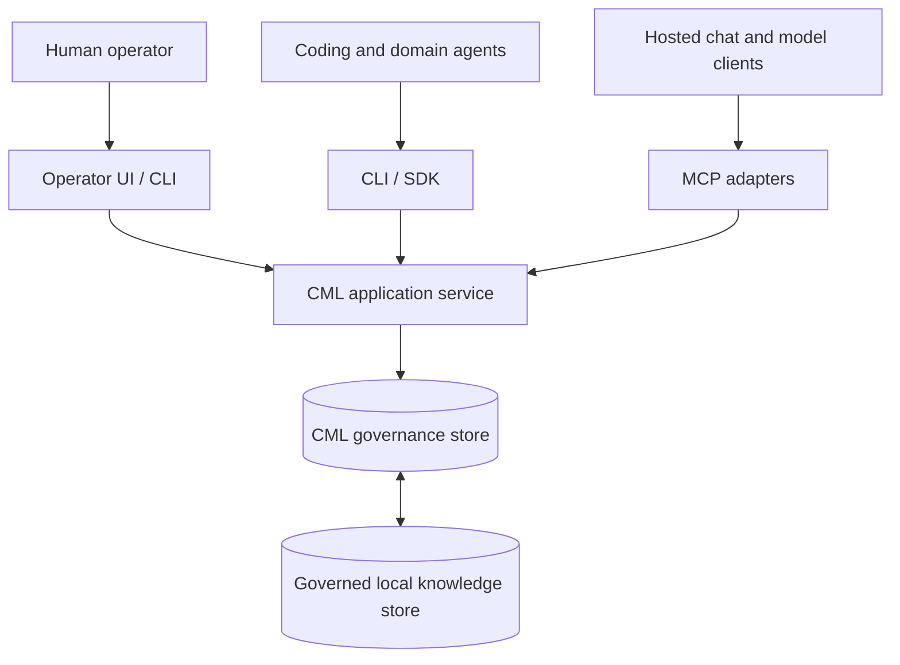
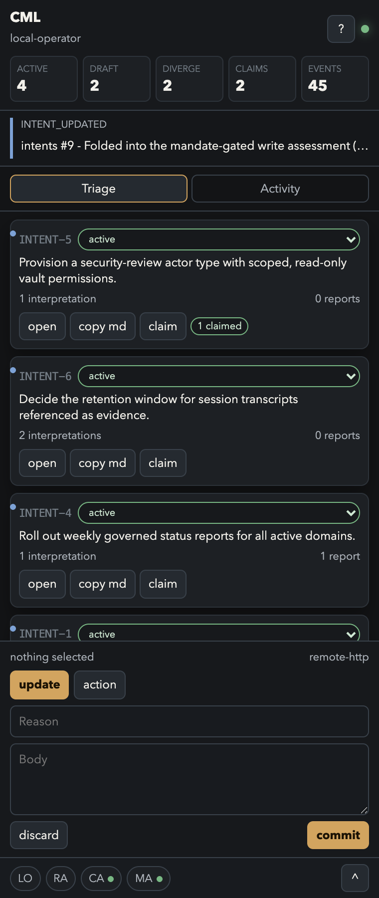

# Context Mediation Layer

Decision governance and correspondence infrastructure for human-AI environments: a layer that mediates what humans and agents may treat as shared, durable, actionable state.

## At a glance

This repository is a working prototype and architecture demonstrator of a
Context Mediation Layer (CML) for governing human-AI environments. It makes
intent, interpretation, authority, evidence, action, and provenance explicit
so that AI-enabled work can be coordinated, audited, replayed, and scaled
across multiple actors and tools.

The core idea is simple: isolated AI workflows should not remain a landscape of little kingdoms, each claiming absolute coherence but unable to meaningfully extend that claim beyond its borders. They need a shared governance layer that turns acceleration into durable shared state rather than faster ambiguity.

The implementation demonstrates how that layer can work locally, across
humans, coding agents, hosted chat agents, tools, and knowledge stores,
without relying on one vendor memory surface or one monolithic agent
framework.


*The Mediation Centre: intents, interpretations, alignment, and claims in the
live store.*

## Quick start

```sh
npm ci
npm run build
node dist/cli/index.js init --pretty
node dist/cli/index.js status --pretty
npm test
```

`init` writes `cml.config.json`, creates a local SQLite database and vault
directory, and provisions a default operator, scope, root contract, agent
actor-type contract, and CLI role binding. Details in
[Setup and configuration](docs/setup-and-configuration.md).

## Architecture spotlight

The implementation keeps three layers separate:

1. **Governance layer**
   Owns CML state: intents, interpretations, actions, reports, claims,
   contracts, actors, roles, sessions, and events.

2. **Runtime layer**
   Provides execution capability behind interfaces. It may host CLIs, SDKs,
   MCP adapters, tools, agents, and operator surfaces, but it does not own
   CML semantics.

3. **Knowledge layer**
   Supplies context, source material, and local content. It can inform
   governed state, but it does not become canonical merely because it is
   useful.



Runtime executes. Knowledge informs. Governance decides what becomes durable,
actionable state.

## The problem

AI reduces the cost of action. It does not reduce the cost of consequences.

In multi-actor AI environments, failure often begins before memory or
retrieval breaks down. It begins when different humans, agents, tools, and
sessions each remain locally coherent while the wider environment loses
shared intent, authority, evidence, ownership, decision history, and
accountability.

The deeper failure mode is not divergence but false convergence: hallucinated
consensus. A generated artefact — a report, a plan, a polished deck — can
carry the format of an agreed position without any deliberation having
produced it. Production quality substitutes for the process that authority
normally certifies. Readers downstream treat the artefact as settled because
it looks settled, and decisions accumulate on state that no one actually
agreed to.

Once an AI-enabled workflow can mutate a repository, write into a knowledge
store, generate a report, call a tool, hand work to another model, or
influence a business decision, the relevant governance questions become:

- Who is acting?
- Under what mandate?
- What did they understand the task to mean?
- Which evidence did they rely on?
- What changed?
- What remains unresolved?
- What can the next actor safely assume?

Prompt discipline and retrieval are not enough to answer these questions.
Retrieval can surface relevant material, but it does not decide which source
is authoritative, which claim is stale, which output is inference, or which
actor is accountable for a change.

CML treats this as a correspondence problem: not an orchestration gap, but a
detachment of declared from actual state. The full argument is in
[Why correspondence](#why-correspondence) below.

## What the layer does

Four refusals define the layer:

**Knowledge is not truth. Runtime is not authority. A session is not an
identity. An output is not durable state.**

A chat transcript can be evidence. A terminal session can produce good work.
A model can draft an interpretation. But none of those surfaces becomes
canonical merely by existing. Material becomes durable CML state only when it
is promoted into the governance store with attribution, provenance, and a
relevant mandate.

Promotion is a governed write, not a vibe: material enters the store as a
typed record with attribution, provenance, and a mandate reference; status
transitions and supersession are recorded operations, not edits.

The layer gives humans and agents a shared correspondence substrate. It
records what is being attempted, how different actors interpret the work,
which evidence is being used, what actions were taken, under which mandate,
and what remains unresolved.

Divergence is first-class state, not an error condition. Incompatible
interpretations are recorded side by side with their provenance, and
corrections supersede rather than overwrite — so the record shows not only
what was decided, but what was believed before, by whom, and why it changed.

It is deliberately not a personality layer, memory feature, or agent
framework in the usual sense. It sits underneath those surfaces when several
of them need to work together.

The conceptual primitives are:

- **Intent:** what is being attempted.
- **Interpretation:** what an actor believes the intent means from its
  position.
- **Authority / Contract:** the rule, role, or mandate under which
  participation happens.
- **Evidence:** the material a contribution relies on.
- **Promotion:** the governed transition from material to durable state.
- **Supersession:** correction that preserves the record it replaces.
- **Provenance:** who produced what, from where, under which mandate.

The runtime implements these through concrete entities:

- **Action:** an attributable record of a step taken by an actor.
- **Report:** a synthesis, handoff, or governed summary.
- **Claim:** a temporary ownership or active-work signal.
- **Actor:** who or what is accountable for a contribution.
- **Session:** the execution context that produced a trace.
- **Event:** the transition trail.

The governing invariant is:

> Stable actors own accountability. Sessions are execution context. Only
> promoted outputs become durable, actionable state.

The promotion gate exists because generation is cheap and format is
persuasive: the system deliberately refuses to let production quality confer
authority that only mandate and review can grant.

## Governance model

CML treats contracts as first-order governance state. A contract can define
role permissions, actor defaults, participation rules, escalation rules,
write permissions, or process obligations. Contract truth lives in the
registry, not in copied Markdown files or local projections.

Before acting, an actor should establish four things:

1. **Identity:** who or what is operating.
2. **Mandate:** which intent, role, actor type, or contract governs
   participation.
3. **Live governed state:** which relevant intents, interpretations,
   actions, claims, reports, contracts, actors, roles, or domains are in
   play.
4. **Next governed move:** which reversible action, handoff, escalation, or
   unresolved state should happen next.

For substantive mediation, actors separate:

- **Observed:** what was directly found in governed state or cited evidence.
- **Inferred:** what follows from the observed state.
- **Unresolved:** what remains uncertain, contradictory, stale, or
  unauthorised.
- **Proposed:** the next reversible move recommended or taken.

This prevents capable agents from flattening authority, evidence, inference,
and uncertainty into the same confident output.

## Actor topology

CML types authority explicitly. Actors, roles, bindings, sessions, and
contracts are kept distinct because each answers a different governance
question — and because most coordination failures begin when these are
silently conflated.

| Concept | Question it answers |
|---|---|
| Actor | Who is accountable for this contribution? |
| Role | What posture or mandate can be assumed? |
| Binding | On which surface and provider may this actor assume that role? |
| Session | Which execution context produced this trace? |
| Contract | Which active rule or mandate governs the behaviour? |

This distinction matters when models and tools cross surfaces. A high-trust
actor using a hosted chat surface is not the same as every model that can
imitate its style. A role is not an identity. A session is not an actor. A
file called `CONTRACT.md` is not necessarily an active contract.

These boundaries allow plural agents to contribute without pretending that
every participant has the same authority, memory, mandate, or scope.

## Example workflow

A human creates an intent: assess whether a proposed governance change should
be implemented.

A research-oriented actor files an interpretation describing what the change
appears to mean, which assumptions it depends on, and what evidence is
relevant.

A coding actor inspects the implementation surface and records a separate
interpretation describing which components would change, where authority
boundaries could be weakened, and whether the change is technically feasible.

A policy or mediation actor reviews the same intent from the contract layer:
whether the change alters actor permissions, mandate requirements,
knowledge-store write rules, or durable trace semantics.

The human reviews the resulting state in the operator UI or CLI. The decision
is no longer buried across several transcripts. It has a shared shape:
intent, interpretations, evidence, unresolved questions, proposed actions,
and eventually logged implementation work.

If implementation proceeds, actions are filed against the original intent. If
the local knowledge store is changed, the mutation requires an explicit
mandate and is logged back into the governance store.

The useful artefact is not only the final code change or note edit. It is the
durable governed record left behind for the next actor.

## Current implementation snapshot



This repository is a working prototype and architecture demonstrator, not a
production platform.

The current implementation includes:

- TypeScript governance service with SQLite/WAL persistence.
- CLI control plane for actors, roles, sessions, intents, interpretations,
  actions, reports, claims, contracts, events, and knowledge-store
  operations.
- SDK/API layer over the same service model.
- MCP stdio/HTTP adapters and a restricted public bridge.
- Browser-based operator UI (the Mediation Centre) for live CML inspection
  and governed writes, plus an operator sidebar designed to run alongside an
  AI assistant during governed review sessions.
- Governed local knowledge-store read/write bridge, with mutations requiring
  an intent mandate and logging a CML action.
- First-order contract registry with active hierarchy, immutable revisions,
  custodian attribution, content hashes, parent keys, mandate references, and
  supersession.

Verification for the source snapshot:

```sh
npm test
# 20 test files passed
# 223 tests passed

npm run build
# TypeScript build passed
```

The test count is implementation evidence for this snapshot, not a permanent
API guarantee.

## Why correspondence

CML operationalises a correspondence discipline. In philosophy, the
correspondence theory of truth holds that a statement is true when it
accurately describes the world, not when it merely agrees with other
statements. Agentic environments invert the economics of that distinction:
generated artefacts can agree with each other indefinitely, at almost no
visible cost, while quietly detaching from the ground. While a plausibly
coherent state becomes cheap to produce, the correspondence required to
anchor it in reality has stayed expensive.

CML addresses this gap. Nothing is promoted on plausibility or even coherence
alone: declared state is checked against actual state before an output is
promoted — gated where work is routed through the layer. Recorded claims
carry their falsification conditions as a working discipline, and
supersession keeps the record when one triggers.

## Lineage

This work does not stand on its own feet. The shortest honest ledger of
priors:

- **Correspondence theory of truth** — A statement is true when it describes
  the world, not when it agrees with other statements. The promotion gate
  uses this theory as its master criterion.
- **Karl Popper** — falsifiability as a working field, not a seminar virtue.
  Claims in the lab carry their refutation conditions in the record;
  supersession keeps the history when one fires.
- **Elinor Ostrom** — shared context is a commons. Her design principles for
  governing commons without a central owner — rules congruent with local
  conditions, participation in rule-making, accountable monitoring, graduated
  consequences — are the ancestors of CML's contracts, actors, and gates.
- **The chariot dialogue (Milinda Pañha)** — "chariot" is a designation on an
  assembly of parts, with no essence above them. Institutional cognition is
  used here in exactly that spirit: a composite lens on organisations, never
  a mind within them.
- **Heidegger, over his objection** — equipment disappears while it works and
  becomes visible only in breakdown. CML inverts the sequence deliberately:
  the act of mediation is made inspectable before breakdown does the
  revealing. (He would file correspondence itself as derivative of
  disclosure; the ledger records the disagreement and keeps both.)

## What this demonstrates

The implementation demonstrates a broader design pattern for AI-enabled
organisations:

- Treat intent as durable state.
- Treat interpretation as actor-coupled, not universal truth.
- Treat authority, evidence, inference, and unresolved state as distinct.
- Treat contracts as first-order governance state.
- Treat sessions as provenance, not identity.
- Treat knowledge stores and transcripts as evidence until promoted.
- Treat transport surfaces as adapters over a shared substrate.

This pattern allows different agents, tools, and human operators to remain
distinct while still acting against a shared governed record. It makes
AI-enabled work more auditable, more replayable, and less dependent on an
invisible human operator acting as the integration layer.

The near-term goal is to make a working architecture legible: a local-first
mediation layer where humans and agents can act together under explicit
authority, shared evidence, and durable provenance.

Operational evidence from the lab where this layer was built and first used
— six governance cases with raw records — is published separately:
[cml-evidence-pack](https://github.com/sebb001/cml-evidence-pack).

## Configuration

Copy `.env.example` for environment overrides, or start from
`cml.config.example.json`.

Precedence is:

1. CLI flags
2. Environment variables
3. `cml.config.json`

Generate transparent MCP client/server snippets with:

```sh
node dist/cli/index.js setup mcp --transport stdio --out ./mcp.stdio.json
node dist/cli/index.js setup mcp --transport http --out ./mcp.http.json
node dist/cli/index.js setup mcp --transport public --out ./mcp.public.json
```

## Documentation

- [Concepts and limitations](docs/concepts-and-limitations.md)
- [Setup and configuration](docs/setup-and-configuration.md)
- [Components](docs/components.md)
- [Security](SECURITY.md)

## Related work

- [cml-evidence-pack](https://github.com/sebb001/cml-evidence-pack) —
  operational evidence: six governance cases with raw records, from the lab
  where this layer was built and first used.
- [epilab](https://github.com/sebb001/epilab) — the simulation laboratory
  testing the underlying governance primitives.
- [Governing Epistemic Systems](https://papers.ssrn.com/sol3/papers.cfm?abstract_id=6417898)
  (Bohle, 2026, SSRN) — the companion preprint.

## License

The source code in this repository is licensed under the MIT License. The
root [LICENSE](LICENSE) scopes that grant to code files, tests, scripts,
schemas, and configuration examples needed to build or run the software.

Narrative documentation, evidence material, proposal text, client records,
lab notes, and other non-code materials are not MIT-licensed unless a file
explicitly says otherwise.

Third-party development dependencies remain under their own licences.
